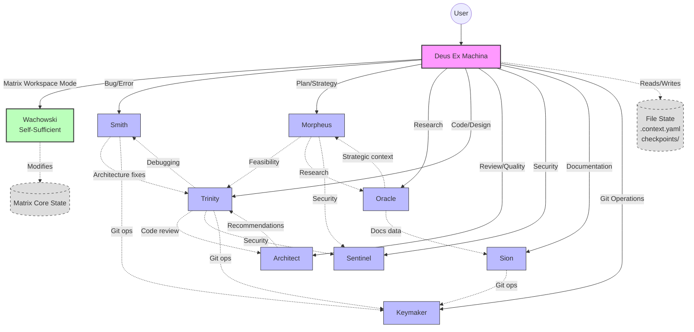

# Agent Dependency Graph

This graph illustrates the hierarchical routing and coordination dependencies between agents in the Matrix system.

## Dependency Rules

1. **Master Isolation**: Users only interact with `Deus Ex Machina`. No direct user-to-specialist interaction.
2. **Keymaker Bottleneck**: Git operations are centralized in `Keymaker` (except for `Wachowski`, which has integrated git capabilities).
3. **Workspace Override**: When in the `~/www/emisrepos/matrix` directory, routing overrides to `Wachowski`.
4. **Coordination via Master**: Specialists technically coordinate by returning control or instructions that the Master then routes, rather than direct peer-to-peer invocation.
