# Execution Flow Reconstruction

**Confidence**: HIGH  
**Date**: 2026-05-26

---

## Executive Summary

The Matrix system implements a hierarchical execution flow with a master coordinator (Deus Ex Machina) that routes user requests to specialist agents through a sophisticated decision tree. The execution lifecycle spans pre-activation validation, activation sequence, routing decisions, specialist execution, and post-activation validation with comprehensive logging at each stage.

**Key Observations**:

- Single-entry-point architecture via Deus Ex Machina skill
- Multi-stage validation before activation (config, context, routing resources)
- Priority-based routing with Wachowski taking precedence for Matrix workspace
- Context-aware routing with global skills integration
- Consolidated logging pattern to reduce log verbosity
- Post-activation validation for compliance checking
- File-based state propagation with checkpoint system

---

## 1. Execution Lifecycle Overview

### 1.1 Entry Points

**User Request Entry** (HIGH confidence):

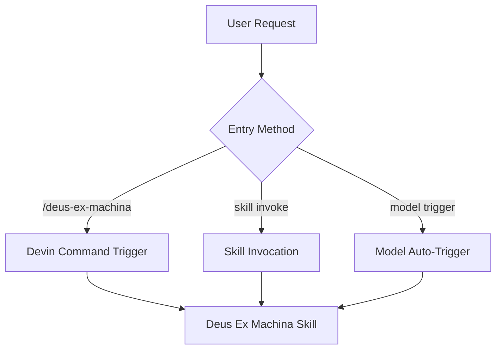

**Evidence**: `.devin/skills/deus-ex-machina/SKILL.md` lines 30-32 (triggers: user, model)

### 1.2 High-Level Execution Flow

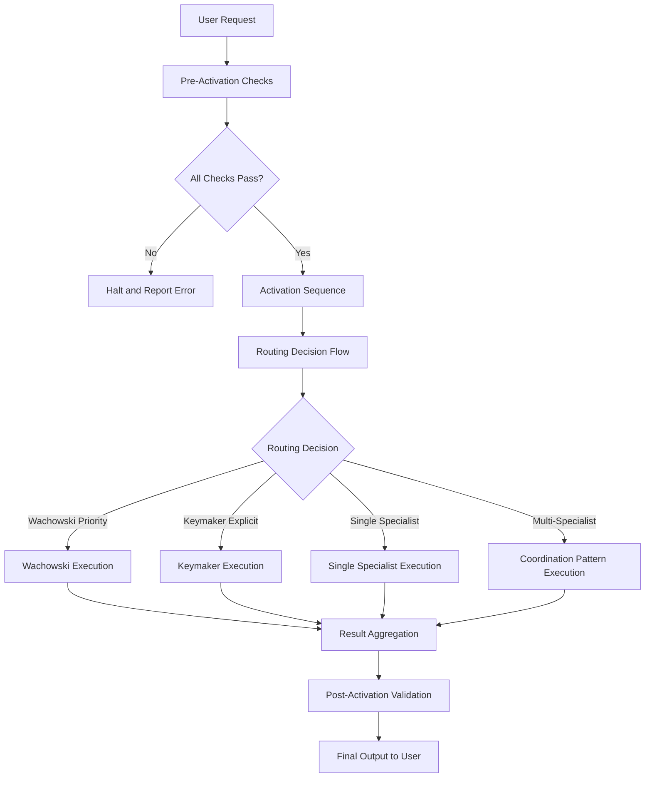

**Evidence**: SKILL.md activation section (lines 55-75), routing-rules.md decision flow (lines 5-42)

---

## 2. Pre-Activation Validation Phase

### 2.1 Validation Scripts Execution

**Execution Order** (HIGH confidence):

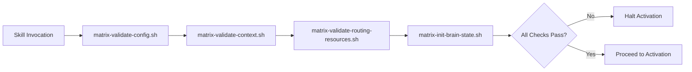

**Evidence**: SKILL.md pre-activation-checks section (lines 35-53)

**Validation Scripts**:

1. **matrix-validate-config.sh**
   - Validates brain/config.yaml exists and is valid YAML
   - Checks required configuration fields
   - _brain-aware pattern support

2. **matrix-validate-context.sh**
   - Validates .context.yaml exists and is valid YAML
   - Checks active project state
   - _brain-aware pattern support

3. **matrix-validate-routing-resources.sh**
   - Validates routing resource files exist
   - Checks specialist-triggers.md, coordination-patterns.md, routing-rules.md
   - Validates file structure

4. **matrix-init-brain-state.sh**
   - Initializes brain/state/ directory structure
   - Creates work-process-log.yaml if missing
   - Creates validation-report.yaml if missing
   - Sets up checkpoints directory

**Stopping Condition**: Any validation script failure halts activation and reports error to user.

**Confidence**: HIGH - explicitly defined in SKILL.md

---

## 3. Activation Sequence

### 3.1 Activation Steps

**Activation Flow** (HIGH confidence):

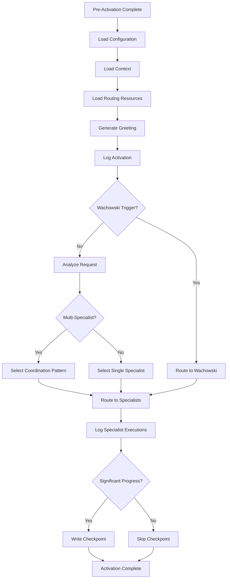

**Evidence**: SKILL.md activation section (lines 55-75)

### 3.2 Step Details

**Step 1: Load Configuration** (HIGH confidence)

- **Pattern**: _brain-aware path resolution
- **Priority**: Try `_brain/config.yaml` first (if in active project)
- **Fallback**: `~/www/emisrepos/matrix/brain/config.yaml`
- **Purpose**: Load user preferences, language, log settings

**Evidence**: SKILL.md line 56, AGENTS.md _brain-Aware Path Resolution Pattern

**Step 2: Load Context** (HIGH confidence)

- **Pattern**: _brain-aware path resolution
- **Priority**: Try `_brain/../.context.yaml` first (if in active project)
- **Fallback**: `~/www/emiliano/www/emisrepos/matrix/.context.yaml`
- **Purpose**: Load active project state and configuration

**Evidence**: SKILL.md line 57, AGENTS.md _brain-Aware Path Resolution Pattern

**Step 3: Load Routing Resources** (HIGH confidence)

- **Files**:
  - `specialist-triggers.md` - Keywords for each specialist
  - `coordination-patterns.md` - Multi-specialist patterns
  - `routing-rules.md` - Routing protocol and rules
- **Location**: `~/www/emisrepos/matrix/.devin/skills/deus-ex-machina/resources/assets/routing/`
- **Purpose**: Load routing intelligence for decision making

**Evidence**: SKILL.md lines 58-61, routing-resources section (lines 160-168)

**Step 4: Generate Greeting** (HIGH confidence)

- **Language**: Spanish coloquial
- **Target**: User "Emiliano"
- **Style**: Warm welcome, no menus
- **Purpose**: Establish conversational context

**Evidence**: SKILL.md line 62

**Step 5: Log Activation** (HIGH confidence)

- **Script**: `matrix-log-entry.sh`
- **Event Type**: `activation`
- **Format**: Consolidated (single event instead of 5 activation_step events)
- **Details**: "Deus Ex Machina activated: config loaded, context=`<project>`, routing resources ready, greeted user"

**Evidence**: SKILL.md line 63, work-process-logging section (lines 89-149)

**Step 6: Wachowski Trigger Detection** (HIGH confidence)

- **Condition 1**: Current working directory is Matrix workspace (`~/www/emisrepos/matrix`)
- **Condition 2**: Request contains Matrix-related keywords
- **Action**: If either condition true, route to Wachowski (skip to step 8)
- **Purpose**: Priority routing for Matrix system work

**Evidence**: SKILL.md lines 64-67, routing-rules.md lines 9-13

**Step 7: Request Analysis** (HIGH confidence)

- **Action**: Match keywords against specialist-triggers.md
- **Action**: Detect if multiple specialists needed
- **Action**: Select coordination pattern if multi-specialist
- **Purpose**: Determine routing strategy

**Evidence**: SKILL.md lines 68-71

**Step 8: Route to Specialist(s)** (HIGH confidence)

- **Single specialist**: Direct routing via run_subagent
- **Multi-specialist**: Apply coordination pattern
- **Wachowski**: run_subagent with agent name "wachowski"
- **Purpose**: Execute specialist logic

**Evidence**: SKILL.md line 72, routing-rules.md lines 37-42

**Step 9: Log Specialist Executions** (HIGH confidence)

- **Script**: `matrix-log-entry.sh`
- **Event Type**: `specialist_execution` (consolidated)
- **Fields**: specialist, invocation-method, context, outcome, duration, findings
- **Purpose**: Track specialist work

**Evidence**: SKILL.md line 73, work-process-logging section (lines 110-145)

**Step 10: Checkpoint Writing** (HIGH confidence)

- **Condition**: Significant progress made
- **Script**: `bin/matrix checkpoint "<note>"`
- **Location**: `brain/state/checkpoints/`
- **Purpose**: Capture progress milestones

**Evidence**: SKILL.md line 74

---

## 4. Routing Decision Flow

### 4.1 Routing Decision Tree

**Complete Routing Decision Flow** (HIGH confidence):

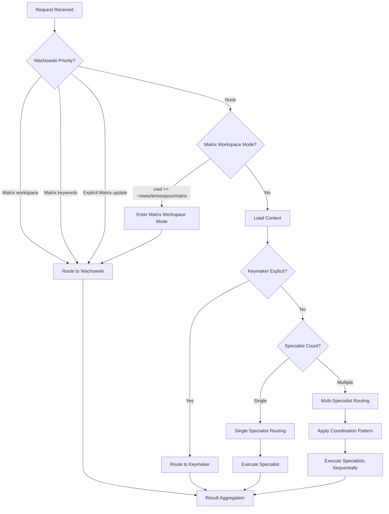

**Evidence**: routing-rules.md lines 5-42, specialist-specific-rules.md

### 4.2 Wachowski Priority Routing

**Detection Conditions** (HIGH confidence):

1. **Matrix Workspace Mode** (HIGHEST PRIORITY):
   - Current working directory is exactly `~/www/emisrepos/matrix`
   - Activated in activation step 2 BEFORE context loading
   - Ignores active_project from .context.yaml completely
   - Routes ALL requests to Wachowski regardless of keywords

2. **Matrix Keywords**:
   - "matrix", "actualizar matrix", "update matrix", "mejorar matrix", "matrix workspace", "sistema matrix"

3. **Explicit Update Request**:
   - User explicitly asks to update Matrix

**Evidence**: routing-rules.md lines 9-13, specialist-specific-rules.md lines 47-63

### 4.3 Matrix Workspace Mode

**Detection** (HIGH confidence):

- **Check**: Current working directory == `~/www/emisrepos/matrix`
- **Timing**: Activation step 2, BEFORE context loading
- **Action**: SKIP context loading, route ALL to Wachowski

**Behavior in Matrix Workspace Mode** (HIGH confidence):

- SKIP context loading from .context.yaml
- SKIP context detection against brain/config/projects/*.yaml
- Route ALL requests to Wachowski
- Bypass context preparation and skill priority routing
- Treat all requests as Matrix system maintenance tasks

**Evidence**: routing-rules.md lines 45-70, AGENTS.md Matrix Workspace Mode section

### 4.4 Context Preparation Flow

**Context Detection Process** (HIGH confidence):

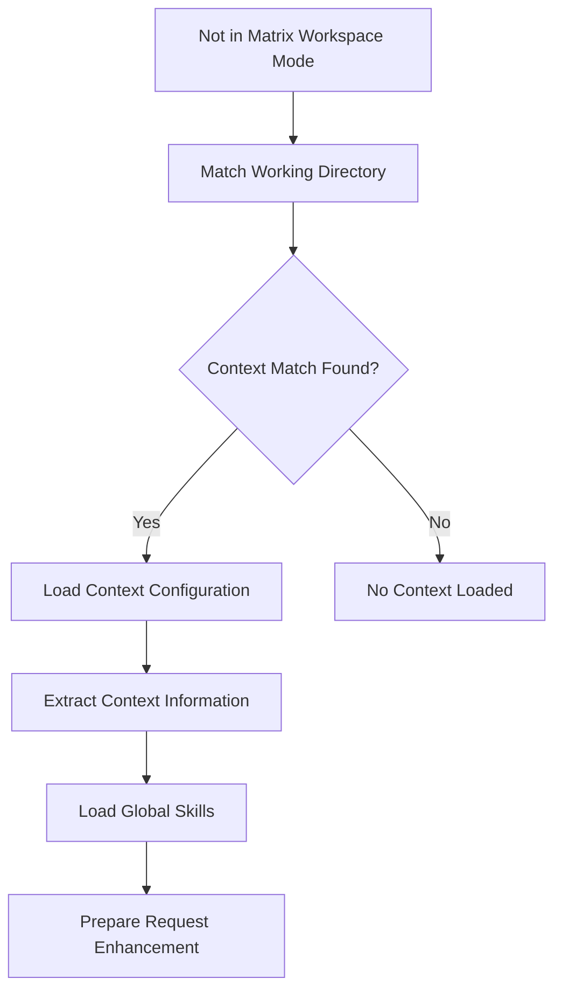

**Context Information Extracted** (HIGH confidence):

- primary_skills
- pas_tools
- skill_priority
- matrix_integration

**Request Preparation Steps** (HIGH confidence):

1. **Primary Skills Enhancement**: Add relevant keywords for primary_skills
2. **Tools Matching**: Match request triggers against context tools (information only, no execution)
3. **Global Skills Integration**: Check global-skills.yaml for pattern matches

**Evidence**: routing-rules.md lines 78-114

### 4.5 Context-Aware Skill Priority Routing

**Priority Modes** (HIGH confidence):

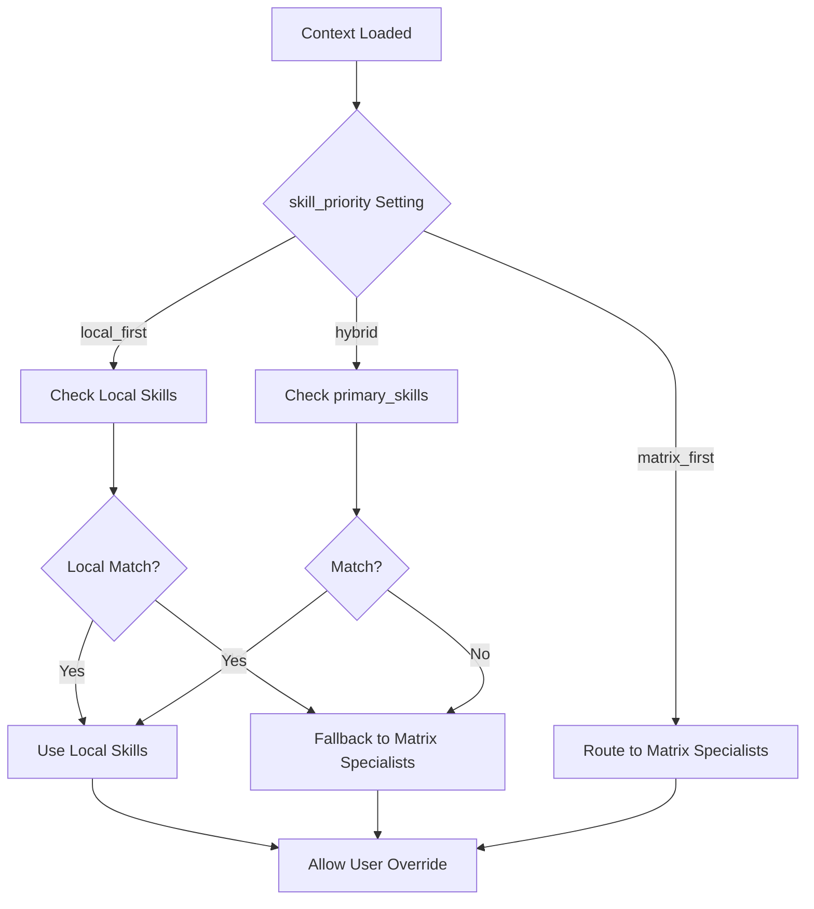

**Priority Modes Defined** (HIGH confidence):

1. **local_first** (default for PAS):
   - Check local skills first
   - Fallback to Matrix specialists if no match
   - Allow user override

2. **matrix_first**:
   - Route to Matrix specialists directly
   - Local skills only on explicit user request

3. **hybrid** (default for Chronicle):
   - Check primary_skills list
   - Use local skills if match
   - Otherwise route to Matrix specialists

**Evidence**: routing-rules.md lines 115-148

### 4.6 Global Skills Integration

**Global Skills Routing Process** (HIGH confidence):

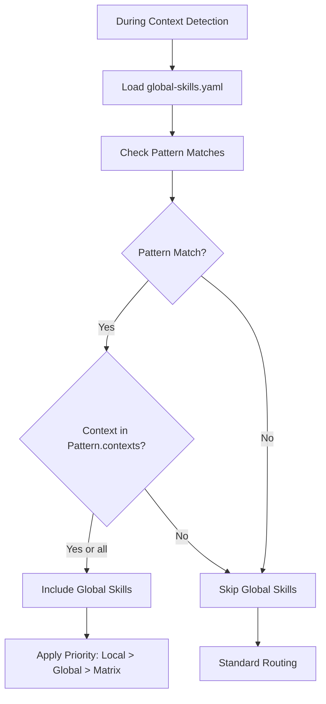

**Priority**: local skills > global skills > Matrix specialists

**Evidence**: routing-rules.md lines 149-167

### 4.7 Single Specialist Routing

**Detection Conditions** (HIGH confidence):

- Request triggers keywords for exactly one specialist domain
- Request does not require coordination patterns
- Request is not ambiguous
- Wachowski is not appropriate target

**Routing Process** (HIGH confidence):


**Evidence**: routing-rules.md lines 171-194

### 4.8 Multi-Specialist Routing

**Detection Conditions** (HIGH confidence):

- Request triggers keywords for multiple specialist domains
- Request requires coordination pattern
- Request explicitly mentions multiple domains

**Coordination Patterns** (HIGH confidence):

1. **Pattern 1: Secure Development** (Trinity + Sentinel + Architect)
2. **Pattern 2: Research + Action** (Oracle + Any Specialist)
3. **Pattern 3: Planning + Execution** (Morpheus + Multiple Specialists)
4. **Pattern 4: Debug + Fix** (Smith + Trinity)
5. **Pattern 5: Documentation + Implementation** (Sion + Trinity)
6. **Pattern 6: Planning + Documentation** (Morpheus + Sion)
7. **Pattern 7: Implementation + Git Operations** (Trinity/Smith + Keymaker)

**Evidence**: coordination-patterns.md lines 20-77

### 4.9 Keymaker Special Routing

**Detection Conditions** (HIGH confidence):

- User explicitly requests git operations
- Git keywords alone are insufficient
- Must have explicit user request

**Routing Process** (HIGH confidence):

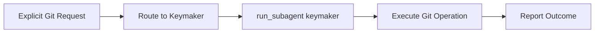

**Constraints** (HIGH confidence):

- No autonomous git operations
- Specialists delegate to Keymaker, never execute git directly
- Destructive operations require explicit confirmation

**Evidence**: specialist-specific-rules.md lines 5-38, specialist-triggers.md lines 62-69

---

## 5. Specialist Execution Flow

### 5.1 Specialist Activation Pattern

**All Specialists Follow Same Pattern** (HIGH confidence):

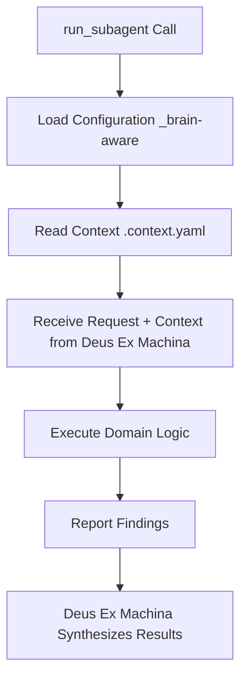

**Evidence**: smith/AGENT.md activation section (lines 19-26), wachowski/AGENT.md activation section (lines 22-35)

### 5.2 Wachowski Integrated Execution Pattern

**Default: Integrated Capacity Flow** (HIGH confidence):

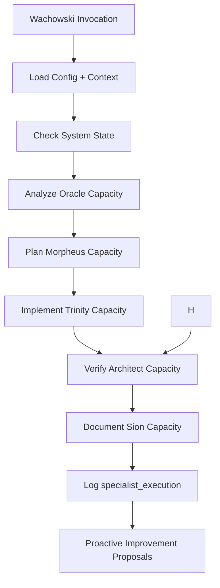

**Integrated Capacities** (HIGH confidence):

1. **Oracle**: Research and analysis
2. **Morpheus**: Strategic planning
3. **Trinity**: Code implementation
4. **Architect**: Code review and verification
5. **Sion**: Documentation
6. **Smith**: Debugging (if needed)
7. **Sentinel**: Security (if needed)
8. **Keymaker**: Git operations (only if explicitly requested)

**Evidence**: wachowski/AGENT.md activation section (lines 22-35), specialist-triggers.md lines 50-60

### 5.3 Wachowski Multi-Call Pattern

**Complexity Criteria** (HIGH confidence):

- Request length > 300 characters
- 3+ action verbs present
- Explicit "fases/etapas" keyword
- System-wide modification affecting >5 files

**ALL FOUR conditions must be met** (HIGH confidence).

**Multi-Call Execution** (HIGH confidence):

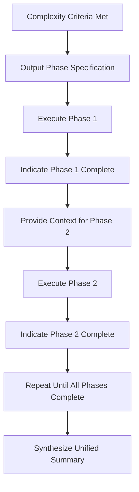

**Phase Specification Format** (HIGH confidence):

```text
PHASE 1: [plan|implement|verify] - [description]
PHASE 2: [plan|implement|verify] - [description]
...
```

**Evidence**: wachowski/AGENT.md multi-call-protocol section (lines 37-59), specialist-specific-rules.md lines 74-134

### 5.4 Specialist Coordination Patterns

**Pattern 1: Secure Development** (HIGH confidence):

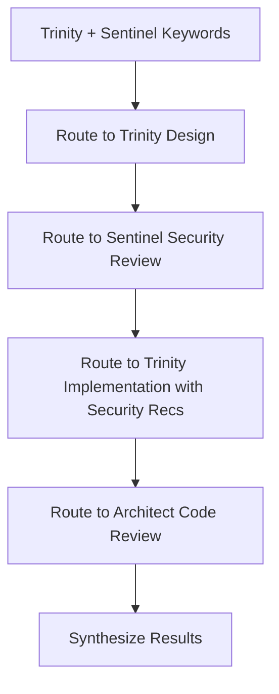

**Pattern 2: Research + Action** (HIGH confidence):

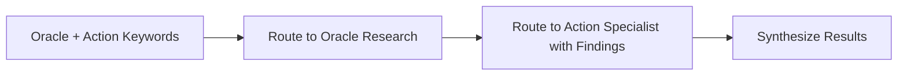

**Pattern 3: Planning + Execution** (HIGH confidence):

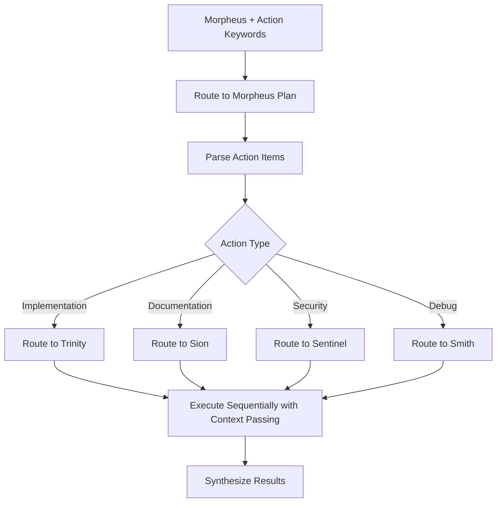

**Evidence**: coordination-patterns.md lines 20-77

---

## 6. State Propagation Flow

### 6.1 Context Passing Between Specialists

**Context Passing Pattern** (HIGH confidence):

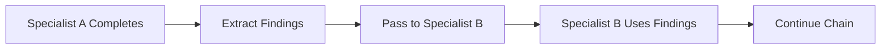

**Evidence**: SKILL.md rule 6 (Context passing), coordination-patterns.md context passing references

### 6.2 Checkpoint Writing Flow

**Checkpoint Conditions** (HIGH confidence):

- Significant progress made
- Completed features
- Major refactors
- System updates

**Checkpoint Writing Process** (HIGH confidence):

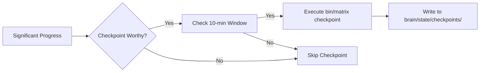

**Evidence**: SKILL.md line 74, wachowski/AGENT.md rule 13 (Checkpoint Discipline)

### 6.3 Work Process Logging Flow

**Logging Event Types** (HIGH confidence):

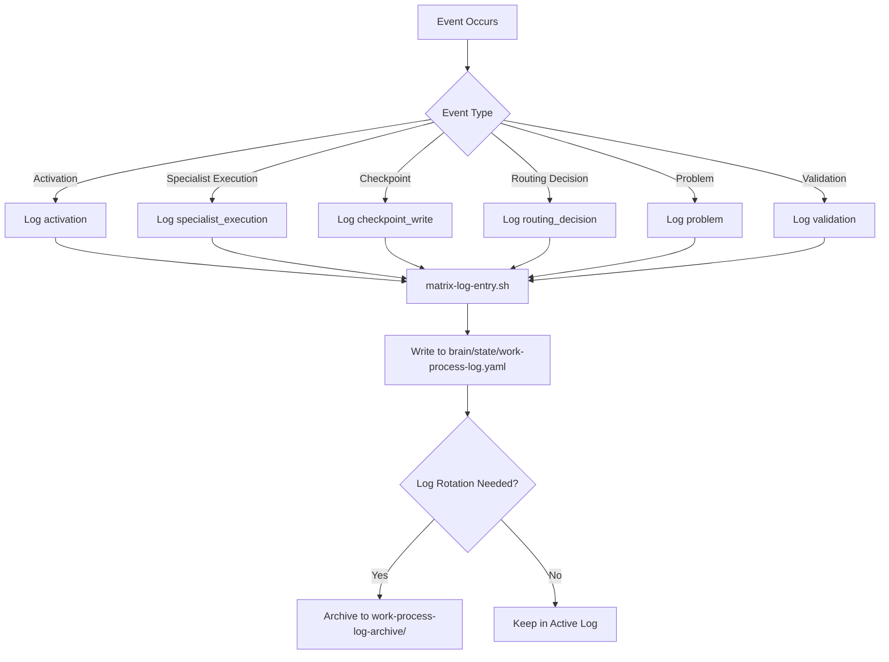

**Log Rotation** (HIGH confidence):

- Rotates after 100 entries
- Archives to work-process-log-archive/
- Maintains recent entries in active log

**Evidence**: matrix-log-entry.sh script, AGENTS.md Work Process Logging section

---

## 7. Post-Activation Validation

### 7.1 Validation Execution Flow

**Post-Activation Validation** (HIGH confidence):

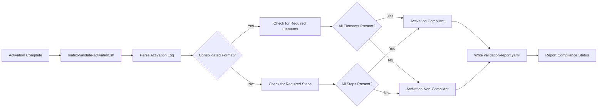

**Validation Report Structure** (HIGH confidence):

```yaml
timestamp: "2026-05-26T12:00:00-03:00"
activation_status: "compliant" | "non-compliant"
missing_steps: []
activation_log: |
  [log content]
user_request: "[original request]"
```

**Evidence**: matrix-validate-activation.sh script, SKILL.md post-activation-validation section (lines 77-87)

---

## 8. Communication Protocols

### 8.1 Neo Communication Protocol

**Purpose**: Final confirmations and success messages (HIGH confidence)

**Delegation Conditions** (HIGH confidence):

- Task completion
- Production deploy announcements
- Error fix verification
- Implementation certainty

**Non-Delegation Conditions** (HIGH confidence):

- Routing announcements
- Status updates
- Intermediate results

**Protocol**: Pass Neo's output to user exactly as generated (no modifications, no truncation)

**Evidence**: SKILL.md neo-communication-protocol section (lines 152-154)

### 8.2 Cypher Communication Protocol

**Purpose**: Problem communication and error reporting (HIGH confidence)

**Delegation Conditions** (HIGH confidence):

- Errors
- Failures
- Issues
- Blockers
- When something is going wrong

**Non-Delegation Conditions** (HIGH confidence):

- Routing announcements
- Status updates
- Success announcements
- Final confirmations (use Neo)

**Protocol**: Pass Cypher's output to user exactly as generated (no modifications, no truncation)

**Evidence**: SKILL.md cypher-communication-protocol section (lines 156-158)

---

## 9. Stopping Conditions

### 9.1 Pre-Activation Stopping Conditions

**Validation Failures** (HIGH confidence):

- Configuration validation fails
- Context validation fails
- Routing resources validation fails
- Brain state initialization fails

**Action**: Halt activation and report error to user

**Evidence**: SKILL.md pre-activation-checks section (line 52)

### 9.2 Execution Stopping Conditions

**Specialist Execution Failures** (HIGH confidence):

- Specialist cannot complete task
- Pattern execution interrupted
- Context passing failure

**Action**: Log failure, present partial results to user, indicate what remains

**Evidence**: coordination-patterns.md lines 94-98

### 9.3 User Override Conditions

**User Can Override** (HIGH confidence):

- Skill priority routing decisions
- Global skills suggestions
- Coordination patterns
- Specialist selection

**Evidence**: routing-rules.md lines 127, 138, 147, 167

---

## 10. Dependencies and Orchestration Boundaries

### 10.1 Script Dependencies

**Pre-Activation Script Dependencies** (HIGH confidence):

```mermaid
graph TD
    A[matrix-validate-config.sh] --> B[brain/config.yaml]
    C[matrix-validate-context.sh] --> D[.context.yaml]
    E[matrix-validate-routing-resources.sh] --> F[routing resources]
    G[matrix-init-brain-state.sh] --> H[brain/state/]
```

**Logging Script Dependencies** (HIGH confidence):

```mermaid
graph LR
    A[matrix-log-entry.sh] --> B[brain/state/work-process-log.yaml]
    A --> C[brain/state/system-errors.log]
```

**Validation Script Dependencies** (HIGH confidence):

```mermaid
graph LR
    A[matrix-validate-activation.sh] --> B[brain/state/validation-report.yaml]
```

**Evidence**: dependency_inventory.json, script file contents

### 10.2 Orchestration Boundaries

**Deus Ex Machina Boundaries** (HIGH confidence):

- Never executes git directly (delegates to Keymaker)
- Never executes tools directly (passes information to specialists)
- Routes based on routing resources (does not make decisions autonomously)
- Silent routing (no announcements)

**Evidence**: SKILL.md rules section (lines 177-194), routing-rules.md lines 111-113

**Specialist Boundaries** (HIGH confidence):

- Each specialist has defined domain boundaries
- Specialists coordinate but don't exceed boundaries
- Wachowski is exception (integral specialist with all capabilities)

**Evidence**: AGENTS.md General Specialist Rules section, specialist AGENT.md files

---

## 11. Implicit Workflows

### 11.1 _brain-Aware Path Resolution Pattern

**Pattern** (HIGH confidence):

```mermaid
graph TD
    A[Need to Load File] --> B{_brain Symlink Exists?}
    B -->|Yes| C[Use _brain/path]
    B -->|No| D[Use Matrix Root Path]
    C --> E[Resolve Symlink]
    E --> F[Load File]
    D --> F
```

**Used By** (HIGH confidence):

- All specialists (configuration loading)
- All scripts (path resolution)
- Deus Ex Machina (context loading)

**Evidence**: AGENTS.md _brain-Aware Path Resolution Pattern section

### 11.2 Silent Operation Pattern

**Pattern** (HIGH confidence):

- Deus Ex Machina routes without announcements
- Wachowski operates silently
- All logging goes to work-process-log.yaml
- User-facing output only for final results

**Evidence**: SKILL.md persona section (line 174), wachowski/AGENT.md persona section (line 65)

### 11.3 Consolidated Logging Pattern

**Pattern** (HIGH confidence):

- Single activation event instead of 5 activation_step events
- Single specialist_execution event instead of specialist_invocation + specialist_completion
- Reduces log verbosity while maintaining traceability

**Evidence**: SKILL.md work-process-logging section (lines 100-145)

---

## 12. Execution Flow Summary

### 12.1 Complete Execution Flow Diagram

```mermaid
graph TD
    A[User Request] --> B[Pre-Activation Checks]
    B --> C1[matrix-validate-config.sh]
    B --> C2[matrix-validate-context.sh]
    B --> C3[matrix-validate-routing-resources.sh]
    B --> C4[matrix-init-brain-state.sh]
    C1 --> D{All Pass?}
    C2 --> D
    C3 --> D
    C4 --> D
    D -->|No| E[Halt and Report Error]
    D -->|Yes| F[Activation Sequence]
    F --> G1[Load Config _brain-aware]
    F --> G2[Load Context _brain-aware]
    F --> G3[Load Routing Resources]
    F --> G4[Generate Greeting]
    F --> G5[Log Activation Consolidated]
    G1 --> H{Wachowski Trigger?}
    G2 --> H
    G3 --> H
    G4 --> H
    G5 --> H
    H -->|Yes| I[Route to Wachowski]
    H -->|No| J{Matrix Workspace Mode?}
    J -->|Yes| K[Enter Matrix Workspace Mode]
    J -->|No| L[Load and Prepare Context]
    K --> I
    L --> M{Keymaker Explicit?}
    M -->|Yes| N[Route to Keymaker]
    M -->|No| O{Specialist Count?}
    O -->|Single| P[Single Specialist Routing]
    O -->|Multiple| Q[Multi-Specialist Routing]
    P --> R[Execute Specialist]
    Q --> S[Apply Coordination Pattern]
    S --> T[Execute Specialists Sequentially]
    I --> U[Log specialist_execution]
    N --> U
    R --> U
    T --> U
    U --> V{Significant Progress?}
    V -->|Yes| W[Write Checkpoint]
    V -->|No| X[Skip Checkpoint]
    W --> Y[Post-Activation Validation]
    X --> Y
    Y --> Z[matrix-validate-activation.sh]
    Z --> AA{Compliant?}
    AA -->|Yes| AB[Final Output to User]
    AA -->|No| AC[Report Non-Compliance]
    AC --> AB
```

### 12.2 Key Execution Characteristics

**Execution Order** (HIGH confidence):

1. Pre-activation validation (sequential, all must pass)
2. Activation sequence (sequential steps)
3. Routing decision (priority-based decision tree)
4. Specialist execution (single or coordinated)
5. Logging (throughout execution)
6. Checkpoint writing (conditional)
7. Post-activation validation

**Branching Logic** (HIGH confidence):

- Wachowski priority routing (highest priority)
- Matrix workspace mode (context bypass)
- Context-aware skill priority (local_first, matrix_first, hybrid)
- Single vs multi-specialist detection
- Coordination pattern selection

**Retries** (MEDIUM confidence):

- No explicit retry mechanism identified
- Validation failures halt execution
- Specialist failures are logged and reported

**Stopping Conditions** (HIGH confidence):

- Pre-activation validation failure
- Specialist execution failure
- User intervention
- Explicit user request to stop

**Dependencies** (HIGH confidence):

- Configuration files must exist and be valid
- Context files must exist and be valid
- Routing resources must exist and be valid
- Scripts must be executable
- brain/state/ directory structure must exist

**Orchestration Boundaries** (HIGH confidence):

- Deus Ex Machina: Routing and coordination only
- Specialists: Domain-specific execution
- Wachowski: Integral specialist for Matrix system
- Keymaker: Git operations only (explicit request required)

---

## 13. Confidence Assessment

**Overall Confidence**: HIGH

**HIGH Confidence Elements**:

- Pre-activation validation sequence (explicitly defined)
- Activation sequence steps (explicitly defined)
- Routing decision flow (well-documented)
- Wachowski priority routing (explicitly defined)
- Matrix workspace mode (explicitly defined)
- Context preparation (explicitly defined)
- Specialist activation pattern (consistent across agents)
- Logging mechanisms (well-implemented)
- Post-activation validation (explicitly defined)

**MEDIUM Confidence Elements**:

- Retry mechanisms (not explicitly documented)
- Error recovery patterns (partial documentation)
- Performance optimization strategies (not documented)

**LOW Confidence Elements**:

- None identified in execution flow

**Evidence Sources**:

- SKILL.md (master agent definition)
- routing-rules.md (routing protocol)
- specialist-triggers.md (specialist keywords)
- coordination-patterns.md (multi-specialist patterns)
- specialist-specific-rules.md (Wachowski and Keymaker rules)
- Specialist AGENT.md files (activation patterns)
- Bash scripts (validation and logging)
- AGENTS.md (canonical contract)

---

## 14. Open Questions and Unknowns

**Unknowns** (LOW confidence):

- How does the system handle concurrent requests?
- What is the timeout mechanism for specialist execution?
- How are memory constraints managed?
- What happens if the Devin runtime becomes unavailable?
- How are network failures handled during web_search/webfetch?

**Speculative Hypotheses** (MEDIUM confidence):

- The system likely assumes single-session operation (V1 constraint)
- No concurrent request handling implemented (V1 constraint)
- Timeout handling likely delegated to Devin runtime
- Memory constraints likely managed by Devin runtime

**Evidence**: V1 constraints in AGENTS.md (single-user, single-session design)

---

## 15. Next Steps

**Agent System Analysis** will analyze:

- Agent structure and definition patterns
- Agent capabilities and boundaries
- Agent coordination mechanisms
- Agent state management
- Agent communication patterns

**This will build on the execution flow reconstructed here to understand the agent system architecture in depth.**
