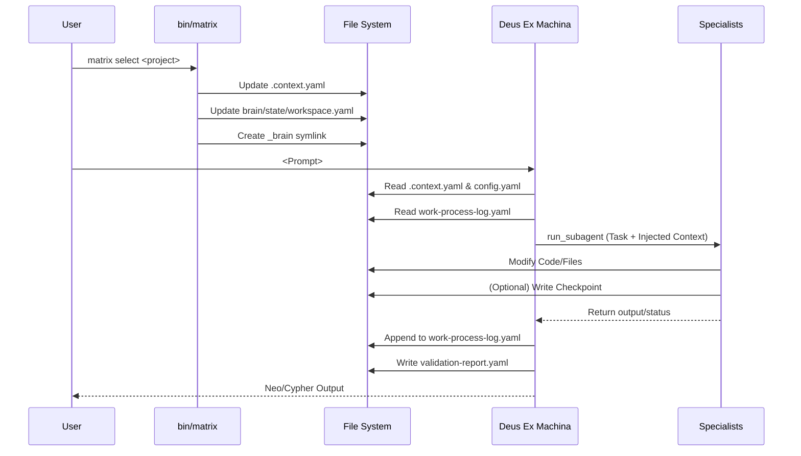

# Phase 5: State and Memory Analysis

This document analyzes where state lives, how memory propagates through the Matrix system, and how continuity is preserved across sessions and agents.

## 1. State Topology

The Matrix system employs entirely **File-Based State Management**. There are no background databases (e.g., SQLite, Postgres) active in v1. State is distributed across several key files inside the repository.

### 1.1 Persistent Context (Global State)
* `brain/state/workspace.yaml`: Tracks the currently active project and global system initialization status.
* `.registry.json`: Registry of all known projects and their absolute paths.
* `brain/config.yaml`: Global user preferences and configuration.

### 1.2 Transient Context (Active Session State)
* `.context.yaml`: Sits at the root, tracking `active_project`, `active_project_path`, and `last_updated`. Acts as the fast-read target for agent initialization.
* `brain/state/validation-report.yaml`: Ephemeral artifact tracking the result of the most recent Master agent activation protocol and the last user request.

### 1.3 Immutable Memory (Checkpoints & Logs)
* `brain/state/checkpoints/checkpoint-*.yaml`: Timestamped YAML files storing milestones. Generated explicitly via the `bin/matrix checkpoint` CLI tool or by agent auto-checkpointing.
* `brain/state/work-process-log.yaml`: An append-only audit trail of system events (`activation`, `specialist_execution`, `system_improvement`). Rotates into `brain/state/work-process-log-archive/` to prevent context bloat.
* `brain/state/system-errors.log`: Protected via POSIX `flock`, records orchestration script failures.

## 2. Memory Propagation Model

### 2.1 Between Sessions (Inter-Session Memory)
Since Devin/Windsurf subagents and sessions are stateless upon termination, Matrix preserves continuity by forcing the Master agent to read `.context.yaml` and recent checkpoints during its `<activation>` phase.
* When Deus Ex Machina wakes up, it reads `.context.yaml` to establish location.
* It checks `brain/state/work-process-log.yaml` to understand immediate preceding actions.

### 2.2 Between Agents (Inter-Agent Memory)
Agents do **not** communicate directly with one another via conversational context (there is no message bus).
* **Master -> Specialist**: State is propagated downwards via prompt injection when `run_subagent` is called. The master extracts context from `work-process-log.yaml` and explicit user requests, bundling it into the task assignment.
* **Specialist -> Master**: State propagates upwards implicitly through file modifications (e.g., source code, markdown reports) and explicit terminal output (success/failure messages), which the Master reads upon subagent completion.

### 2.3 _brain Symlink Bridging
When working on external projects (e.g., `sandisk`), the `bin/matrix select` command drops a symlink named `_brain` into the target directory pointing back to `~/www/emisrepos/matrix/brain`. 
* This allows agents spawned in external directories to reliably load Matrix configuration via `_brain/config.yaml`.
* The state is effectively shared back to the central Matrix repository.

## 3. Serialization and Locking

* **Format**: Almost exclusively YAML (`.context.yaml`, logs, checkpoints). JSON is used sparsely (`.registry.json`).
* **Concurrency Protection**: The error logger (`system-errors.log`) uses bash file descriptor locking (`flock`). The main workspace context appears to rely on fast sed/jq overwrites without explicit locking, assuming single-user sequential invocation.

## 4. State Flow Diagram

