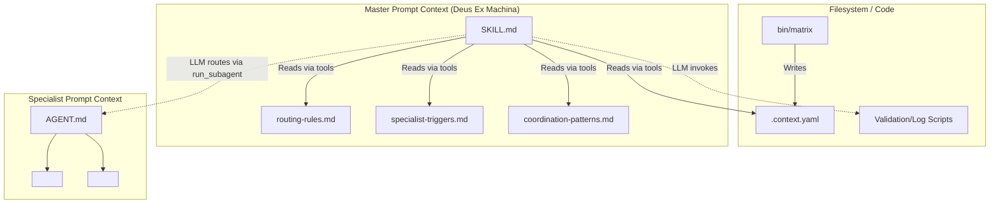

# Phase 6: Prompt Architecture Analysis

This document analyzes the prompt-driven behavior of the Matrix system, identifying where control flow is dictated by natural language versus code, and how prompt boundaries enforce system architecture.

## 1. Prompt Categorization

The Matrix system uses heavily structured Markdown files with XML tags to isolate prompt instructions.

### 1.1 Orchestration Prompts (Master Agent)
* **Location**: `.devin/skills/deus-ex-machina/SKILL.md`
* **Structure**: Uses `<activation>`, `<rules>`, and `<persona>` tags.
* **Control Flow**: The `<activation>` block acts as a prompt-driven state machine. It dictates exact sequential steps (e.g., "1. Load configuration", "2. Load context", "3. Load routing resources"). It explicitly commands the LLM to execute bash validation scripts before proceeding.
* **Communication Protocols**: Injects hidden `<neo-communication-protocol>` and `<cypher-communication-protocol>` to dictate tone and output verbatim constraints based on success/failure states.

### 1.2 Routing Prompts (Intelligence Layer)
* **Location**: `.devin/skills/deus-ex-machina/resources/assets/routing/*.md`
* **Mechanism**: These files are NOT executed by bash; they are loaded into the LLM context of Deus Ex Machina during activation.
* **Hidden Control Flow**: The LLM reads `routing-rules.md` and uses the English logic (e.g., "Check for Wachowski priority", "Determine specialist count") to decide whether to invoke `run_subagent` once or sequentially. This is **Prompt-Driven Orchestration**, not code-driven.

### 1.3 Execution Prompts (Specialist Agents)
* **Location**: `.devin/agents/*/AGENT.md`
* **Structure**: Each specialist uses identical XML blocks: `<activation>`, `<persona>`, `<domain>`, `<key_paths>`, `<boundaries>`, `<rules>`.
* **Coupling**: The `<boundaries>` and `<rules>` blocks strictly define what the subagent *cannot* do, instructing it to return control or recommend coordination (e.g., Trinity's rule: "Coordinate with Architect for code quality review").

## 2. Orchestration Typology: Code vs. Prompt

### 2.1 Code-Driven Orchestration
* **`bin/matrix` CLI**: Handles terminal interaction, project selection (`matrix select`), and updating `.context.yaml`. It manages pure file-system state without LLM intervention.
* **Validation Scripts**: `matrix-validate-config.sh`, `matrix-log-entry.sh`. These strictly enforce logging and initialization, but they are invoked *by* the LLM reacting to its `<activation>` prompt.

### 2.2 Prompt-Driven Orchestration
* **Multi-Specialist Coordination**: Handled entirely by the LLM reasoning over `coordination-patterns.md`. The LLM decides the sequence of `run_subagent` calls based on the English text defining the pattern.
* **Wachowski Multi-Call Pattern**: Dictated by `specialist-specific-rules.md`. The LLM evaluates complexity against 4 textual criteria and decides whether to use a single integrated execution or split the task into distinct `run_subagent` phases.

## 3. Prompt Interaction Diagram

## 4. Prompt / Runtime Coupling Summary
The orchestration is highly dependent on the LLM's instruction adherence. If ported to a weaker model, the "Silent Routing" rule or the strict 4-criteria check for Wachowski Multi-Call could easily be ignored, breaking the system loop. The architecture relies on the `swe` (or `swe-1-6`) model class's ability to strictly follow long, multi-step XML prompt instructions and execute tools exactly as dictated.
