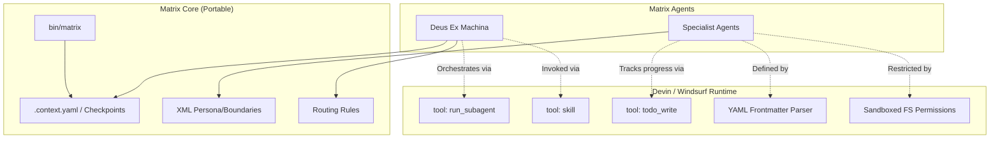

# Provider Coupling Analysis

This document identifies how tightly the Matrix system is coupled to its current runtime (Devin / Windsurf) and outlines the abstractions required to port it to other agentic runtimes (e.g., Claude Code, OpenHands, Gemini CLI).

## 1. Devin/Windsurf Coupling Points

### 1.1 Tool Invocation (High Coupling)
The Matrix system heavily relies on proprietary tools provided by the Devin environment:
* `run_subagent`: Used exclusively by Deus Ex Machina to route tasks to specialists. This is a critical orchestration blocker for portability, as other systems handle sub-agents differently.
* `skill` / `skill invoke`: Used to invoke the master agent (`deus-ex-machina`) and interface with global tools.
* `todo_write`: Frequently used for task breakdown and planning by specialists (Trinity, Smith, Morpheus).
* `ask_user_question`: Relied upon for structured user prompts.

### 1.2 Agent Definition Format (High Coupling)
Matrix specialist agents are defined using Devin's native Agent and Skill Markdown formats:
* **YAML Frontmatter**: Defines `model`, `allowed-tools`, and `permissions` (e.g., `Read(**)`, `Write(matrix/**)`).
* **Directory Structure**: Hardcoded reliance on `.devin/agents/` and `.devin/skills/`.

### 1.3 Memory and Session Lifecycle (Medium Coupling)
While Matrix explicitly avoids databases in favor of its own `brain/state/` file-based system (which is highly portable), it still operates under Devin's session boundaries:
* **Stateless Subagents**: The system assumes `run_subagent` spawns a stateless agent that only knows what is provided in the prompt or file system.
* **Global Rules**: Integrates with global Windsurf rules (e.g., `~/.codeium/windsurf/memories/global_rules.md`) for memory compaction, though Matrix maintains its own `.context.yaml` isolation.

## 2. OS and Runtime Dependencies

### 2.1 Shell Requirements (Low Coupling)
The system orchestration via the CLI (`bin/matrix`) assumes a standard POSIX environment:
* **Bash**: `set -euo pipefail` strictly enforced.
* **Utilities**: Heavily dependent on `jq` (JSON parsing), `sed`, `grep`, `mktemp`, `flock` (for concurrent error logging locks).
* **Git**: Assumes standard `git` CLI availability for `Keymaker` operations and remote repository cloning.

### 2.2 Filesystem Assumptions (Medium Coupling)
* **Symlinking**: The `_brain` symlink pattern is critical for context switching. This requires a filesystem that supports soft links and a runtime that correctly resolves them (not always true in Dockerized sandboxes).
* **Absolute Pathing**: Assumes execution in or relation to `~/www/emisrepos/matrix`.

## 3. Portability Assessment

### 3.1 Portable Abstractions (Keep as-is)
* **State Management**: The file-based checkpointing (`brain/state/checkpoints/`) and `.context.yaml` mechanism is 100% portable.
* **Persona and Activation Prompts**: The XML tag structure (`<persona>`, `<activation>`, `<boundaries>`) can be fed directly into any LLM system prompt.
* **CLI Orchestrator**: The `bin/matrix` script will run natively in any Unix environment.

### 3.2 Required Shims for Portability (Refactor Targets)
To run Matrix on OpenHands or Claude Code, the following abstractions must be built:
1. **Subagent Router Shim**: A generic orchestrator to replace `run_subagent`, translating the intent into the target platform's multi-agent or thread-spawning API.
2. **Tool Translation Layer**: Mapping `todo_write` to generic file writes or markdown task lists, and `ask_user_question` to standard terminal STDIN prompts.
3. **Agent Parser**: A script that reads `.devin/agents/*/AGENT.md` and converts the YAML frontmatter into the target provider's expected configuration format (e.g., JSON schema for OpenHands).

## 4. Provider Interaction Diagram

