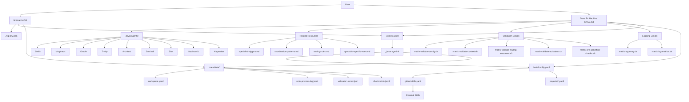

# Repository Mapping

**Confidence**: HIGH  
**Date**: 2026-05-26

---

## Executive Summary

The Matrix repository is a personal intelligence engine implementing a QIE (Quantum Intelligence Engine) architectural pattern with a master coordinator (Deus Ex Machina) and specialist agents. The system uses Devin's native skill/subagent structure with file-based state management and project context awareness.

**Key Observations**:

- Single-master, multi-specialist architecture with 9 specialist agents
- File-based state management (no databases)
- Project context system with symlink bridge pattern
- Bash-based CLI for project management
- Comprehensive logging and validation infrastructure
- Context-aware routing with global skills integration

---

## 1. Repository Structure

### Root Directory Layout

```text
matrix/
├── .registry.json              # Project registry
├── .context.yaml               # Active project context
├── .matrix-root                # Matrix root marker
├── .gitignore                  # Git ignore rules
├── AGENTS.md                   # Canonical operating contract
├── DEVIN.md                    # Devin integration notes
├── README.md                   # System documentation
├── onboarding.html             # Onboarding documentation
├── bin/
│   └── matrix                  # Main CLI orchestrator
├── .devin/
│   ├── skills/
│   │   └── deus-ex-machina/
│   │       ├── SKILL.md        # Master agent skill definition
│   │       ├── scripts/        # Validation and logging scripts
│   │       └── resources/
│   │           └── assets/
│   │               ├── logging/
│   │               └── routing/
│   └── agents/                 # Specialist agent definitions
│       ├── smith/AGENT.md
│       ├── morpheus/AGENT.md
│       ├── oracle/AGENT.md
│       ├── trinity/AGENT.md
│       ├── architect/AGENT.md
│       ├── sentinel/AGENT.md
│       ├── sion/AGENT.md
│       ├── wachowski/AGENT.md
│       └── keymaker/AGENT.md
├── brain/
│   ├── config.yaml             # User configuration
│   ├── config/
│   │   ├── global-skills.yaml  # Global skills configuration
│   │   └── projects/           # Project-specific configurations
│   ├── workflows/              # Workflow definitions
│   └── state/                  # Runtime state
│       ├── workspace.yaml      # Active projects state
│       ├── work-process-log.jsonl  # Append-only audit trail (JSONL format)
│       ├── validation-report.json  # Activation validation report (JSON format)
│       ├── checkpoints.jsonl   # Timestamped checkpoints (JSONL format)
│       ├── sessions/
│       ├── work-process-log-archive/  # Rotated log files
│       ├── work-process-log-legacy.jsonl  # Legacy YAML→JSONL migration file
│       ├── work-process-log.lock  # Concurrency lock for logging
│       └── pas-tools-index.yaml  # PAS tools index
├── docs/ (removed)             # Analysis methodology (no longer needed)
├── analysis/                   # Analysis artifacts
├── clients/                    # GITIGNORED: Pulled project repos
└── .git/                       # Git repository
```

### Directory Purpose Summary

| Directory | Purpose | Confidence |
|-----------|---------|------------|
| `bin/` | CLI orchestration and project management | HIGH |
| `.devin/skills/` | Devin skill definitions (master agent) | HIGH |
| `.devin/agents/` | Devin subagent definitions (specialists) | HIGH |
| `brain/config/` | System and project configuration | HIGH |
| `brain/state/` | Runtime state and logging (JSONL format) | HIGH |
| `brain/workflows/` | Workflow definitions | HIGH |
| `analysis/` | Analysis artifacts and outputs | HIGH |
| `clients/` | Gitignored project clones | HIGH |

---

## 2. Main Entrypoints

### CLI Entrypoint

**File**: `bin/matrix`  
**Role**: Main CLI orchestrator for project management operations  
**Confidence**: HIGH

**Who references it**:

- Users directly via command line
- Agents via exec tool permissions

**What depends on it**:

- Project registry system (.registry.json)
- Context management (.context.yaml)
- Brain state structure (brain/state/)
- Checkpoint system (brain/state/checkpoints.jsonl)

**Operations provided**:

- `list`: Show all registered projects
- `add <name> <path>`: Register new project
- `select <name>`: Set active project and create brain symlink
- `deselect`: Clear active project and remove symlink
- `status`: Show current system status
- `checkpoint "<note>"`: Write timestamped checkpoint

### Master Agent Entrypoint

**File**: `.devin/skills/deus-ex-machina/SKILL.md`  
**Role**: Master agent skill definition - sole user interface  
**Confidence**: HIGH

**Who references it**:

- Users via `/deus-ex-machina` command
- Users via `skill invoke deus-ex-machina`
- Devin runtime system

**What depends on it**:

- All specialist agents (.devin/agents/*/AGENT.md)
- Routing resources (.devin/skills/deus-ex-machina/resources/assets/routing/)
- Validation scripts (.devin/skills/deus-ex-machina/scripts/)
- Brain configuration (brain/config.yaml)
- Context system (.context.yaml)
- State management (brain/state/)


---

## 3. Runtime Environments

### Devin Runtime

**Type**: Primary runtime environment  
**Confidence**: HIGH

**Description**: Matrix is designed to run within Devin's AI development environment using native skill and subagent structures.

**Runtime assumptions**:

- Devin skill system available
- Devin subagent system available
- File system access with standard permissions
- Bash shell available for script execution
- Git available for version control operations

**Evidence**:

- All agents use Devin YAML frontmatter format
- Master agent implemented as Devin skill
- Specialists implemented as Devin subagents
- Permissions use Devin's allow pattern syntax
- Tool permissions aligned with Devin tool set

### Bash Runtime

**Type**: Script execution environment  
**Confidence**: HIGH

**Description**: Bash scripts handle validation, logging, and CLI operations.

**Runtime assumptions**:

- Bash 4.0+ available
- Standard Unix utilities (jq, sed, grep, find)
- File locking support (flock)
- Process signal handling (trap)

**Evidence**:

- All scripts use bash shebang
- Error handling with trap
- File locking with flock
- jq for JSON processing

### File System Runtime

**Type**: State persistence layer  
**Confidence**: HIGH

**Description**: All state stored as files (no databases per V1 constraints).

**Runtime assumptions**:

- Standard file system with hierarchical directories
- Symlink support for _brain bridge pattern
- File permissions for security (600 for sensitive files)
- Atomic file operations for state consistency

**Evidence**:

- brain/state/ contains all runtime state
- Checkpoints stored as JSONL file (O(1) append performance)
- Work process log as JSONL file (append-only audit trail)
- Configuration as YAML files
- No database dependencies in V1 constraints

---

## 4. Configuration Files

### System Configuration

**File**: `brain/config.yaml`  
**Role**: User preferences and system settings  
**Confidence**: HIGH

**Who references it**:

- All agents (via _brain-aware pattern)
- Master agent (Deus Ex Machina)
- Validation scripts

**What depends on it**:

- User language preference
- Log level configuration
- Log quality metrics thresholds
- Timezone configuration
- Default output format

**Key settings**:

```yaml
user: "Emiliano"
language: "es"
default_output_format: "markdown"
timezone: "America/Argentina/Buenos_Aires"
log_level: "INFO"
redundancy_threshold: 10
verbosity_threshold: 250
error_rate_threshold: 5
checkpoint_frequency_threshold: 10
activation_success_threshold: 95
```

### Project Registry

**File**: `.registry.json`  
**Role**: Registry of all known projects  
**Confidence**: HIGH

**Who references it**:

- CLI (bin/matrix) for project operations
- Project selection/deselection
- Project listing

**What depends on it**:

- Project metadata (name, path, type, added timestamp)
- Registry version tracking
- CLI project management operations

**Structure**:

```json
{
  "projects": [
    {
      "name": "project-name",
      "path": "/path/to/project",
      "type": "local|remote",
      "added": "ISO-8601-timestamp"
    }
  ],
  "created": "ISO-8601-timestamp",
  "version": "1.0.0"
}
```

### Active Project Context

**File**: `.context.yaml`  
**Role**: Tracks currently active project  
**Confidence**: HIGH

**Who references it**:

- Master agent (Deus Ex Machina)
- All agents (via _brain-aware pattern)
- CLI for context management
- Validation scripts

**What depends on it**:

- Active project name
- Active project path
- Session tracking
- Context-aware routing decisions

**Structure**:

```yaml
active_project: "project-name"
active_project_path: "/path/to/project"
last_updated: "ISO-8601-timestamp"
session_id: null
```

### Global Skills Configuration

**File**: `brain/config/global-skills.yaml`  
**Role**: Global skills integration settings  
**Confidence**: HIGH

**Who references it**:

- Master agent (context preparation)
- Routing system
- Context-aware skill priority routing

**What depends on it**:

- Global skills path configuration
- Usage patterns for skill routing
- Context-specific skill mappings
- Priority rules (local > global > Matrix)

**Structure**:

```yaml
global_skills:
  path: "/opt/aiad-common/skills/"
  symlink_location: "~/.config/devin/skills/"
  availability: "all_under_home"
  priority: "after_local"
  usage_patterns:
    - pattern: "pattern_name"
      description: "Pattern description"
      contexts: ["context1", "context2"]
      skills: ["skill1", "skill2"]
```

### Project-Specific Configurations

**Files**: `brain/config/projects/*.yaml`  
**Role**: Per-project configuration and context  
**Confidence**: HIGH

**Who references it**:

- Master agent (context detection)
- Routing system (context preparation)
- Skill priority routing

**What depends on it**:

- Project metadata (name, display_name, path, type)
- Project structure configuration
- Working model (primary_skills, skill_priority, matrix_integration)
- Language policy
- Domain-specific settings
- PAS tools configuration

**Example structure (chronicle.yaml)**:

```yaml
context:
  name: "chronicle"
  display_name: "Chronicle"
  path: "/home/emiliano/www/emisrepos/chronicle"
  type: "independent_project"

project_config:
  agents_md: "AGENTS.md"
  agents_path: ".agents/"
  skills_path: ".agents/skills/"
  rules_path: ".agents/rules/"
  workflows_path: ".agents/workflows/"
  windsurf_rules: ".windsurf/rules/"
  windsurf_workflows: ".windsurf/workflows/"

working_model:
  primary_skills: ["skill1", "skill2"]
  skill_priority: "local_first"
  matrix_integration:
    enabled: true
    mode: "hybrid"
    available_specialists: ["oracle", "sentinel", "smith", ...]
    auto_routing: true

language_policy:
  internal: "english"
  user_facing: "rioplatense_spanish"
  policy_file: ".agents/rules/language-policy.md"

domain_specific:
  project_type: "web_app"
  tech_stack: "Vite + React + TypeScript, Dexie.js/IndexedDB, PWA"
  persistence: "Dexie.js (IndexedDB)"
  main_flows: ["Form building", "Project management", ...]

pas_tools:
  enabled: false
  tools_index: null

subprojects: []
```

---

## 5. Agent Definitions

### Master Agent

**File**: `.devin/skills/deus-ex-machina/SKILL.md`  
**Type**: Devin Skill  
**Model**: swe-1-5  
**Confidence**: HIGH

**Role**: Global coordinator and sole user interface  
**Activation**: Via `/deus-ex-machina` or `skill invoke deus-ex-machina`

**Capabilities**:

- Routing intelligence to specialists
- Multi-specialist coordination
- Context detection and preparation
- Work process logging
- Activation protocol enforcement
- Matrix workspace mode detection

**Permissions**:

- Read(\*)
- Write(matrix/\*)
- Exec(~/www/emisrepos/matrix/bin/matrix \*)

**Key features**:

- Pre-activation validation scripts
- Post-activation validation
- Consolidated logging
- Silent routing (no announcements)
- Context-aware skill priority routing
- Global skills integration

### Specialist Agents

All specialists follow the same structure:

- Location: `.devin/agents/<name>/AGENT.md`
- Type: Devin Subagent
- Model: swe-1-5
- Activation: Via run_subagent by Deus Ex Machina only

#### Smith

**Domain**: Bug detection, debugging, troubleshooting  
**Tools**: read, grep, glob, exec, edit, write, todo_write  
**Permissions**: Read(\*), Write(\*)

**Role**: Analyze bugs, identify root causes, propose solutions

#### Morpheus

**Domain**: Strategic planning, roadmap creation, project organization  
**Tools**: read, grep, glob, exec, write, todo_write  
**Permissions**: Read(\*), Write(matrix/\*)

**Role**: Create strategic plans, organize complex projects, allocate resources

#### Oracle

**Domain**: Research, information gathering, pattern analysis  
**Tools**: read, grep, glob, web_search, webfetch, write  
**Permissions**: Read(\*), Write(matrix/\*)

**Role**: Search internal/external sources, synthesize findings, identify patterns

#### Trinity

**Domain**: Code design, architecture, implementation  
**Tools**: read, grep, glob, exec, edit, write, todo_write  
**Permissions**: Read(\*), Write(\*)

**Role**: Design solutions, implement code, write tests

#### Architect

**Domain**: Code review, quality assurance, best practices  
**Tools**: read, grep, glob, exec, write  
**Permissions**: Read(\*), Write(matrix/\*)

**Role**: Review code, ensure quality standards, suggest improvements

#### Sentinel

**Domain**: Security analysis, vulnerability detection  
**Tools**: read, grep, glob, exec, write  
**Permissions**: Read(\*), Write(matrix/\*)

**Role**: Identify security problems, assess risks, provide security analysis

#### Sion

**Domain**: Documentation, knowledge management  
**Tools**: read, grep, glob, edit, write  
**Permissions**: Read(\*), Write(\*)

**Role**: Create documentation, organize knowledge, maintain information

#### Wachowski

**Domain**: Matrix system integral specialist  
**Tools**: read, grep, glob, exec, edit, write, skill, run_subagent, read_subagent  
**Permissions**: Read(\*), Write(matrix/\*), Exec(../../../../bin/matrix \*)

**Role**: Handle all Matrix workspace and system update tasks with integrated specialist capabilities

**Special characteristics**:

- Self-sufficient (no coordination with other specialists)
- Integrated execution pattern (analyze → plan → implement → verify → document)
- Multi-call protocol for genuinely complex tasks
- Matrix workspace mode trigger
- State-of-the-art practices for Matrix work

#### Keymaker

**Domain**: Git operations, version control  
**Tools**: read, grep, exec, edit, find_file_by_name  
**Permissions**: Read(\*), Write(\*)

**Role**: Handle all git-related operations safely and appropriately

**Special routing constraint**: Only invoked when user explicitly requests git operations

---

## 6. Prompt Definitions

### Analysis Prompts (Removed)

**Status**: Removed - no longer needed after analysis completion

The `prompts/` directory and `docs/analysis_protocol.md` were used during the reverse engineering process but are no longer required now that the analysis artifacts are complete.

---

## 7. Workflow Definitions

**Location**: `brain/workflows/`  
**Current state**: Contains only README.md  
**Confidence**: HIGH

**File**: `brain/workflows/README.md`  
**Role**: Placeholder for workflow definitions  
**Content**: "This directory contains workflow definitions for the Matrix intelligence engine. Workflows define repeatable processes that agents can execute."

**Observation**: Workflow definitions are planned but not yet implemented. Current system uses coordination patterns in routing resources instead.

---

## 8. Scripts and Automation

### Validation Scripts

**Location**: `.devin/skills/deus-ex-machina/scripts/`  
**Purpose**: Pre-activation validation and post-activation compliance  
**Confidence**: HIGH

#### matrix-pre-activation-checks.sh

**Role**: Consolidated pre-activation validation  
**Who references it**: Deus Ex Machina skill (pre-activation-checks block)  
**What it validates**: Configuration, context, routing resources, brain state

#### matrix-validate-config.sh

**Role**: Validate brain/config.yaml exists and is valid YAML  
**Who references it**: matrix-pre-activation-checks.sh  
**What it validates**: Configuration file existence and YAML syntax

#### matrix-validate-context.sh

**Role**: Validate .context.yaml exists and has active project  
**Who references it**: matrix-pre-activation-checks.sh  
**What it validates**: Context file existence and active project setting

#### matrix-validate-routing-resources.sh

**Role**: Validate routing resources exist  
**Who references it**: matrix-pre-activation-checks.sh  
**What it validates**: specialist-triggers.md, coordination-patterns.md, routing-rules.md

#### matrix-validate-activation.sh

**Role**: Post-activation validation compliance check  
**Who references it**: Deus Ex Machina skill (post-activation-validation block)  
**What it validates**: Activation protocol compliance, writes validation-report.json

### State Management Scripts

#### matrix-init-brain-state.sh

**Role**: Initialize brain state directory structure  
**Who references it**: Deus Ex Machina skill (pre-activation-checks block)  
**What it does**: Creates work-process-log.jsonl if missing, creates validation-report.json if missing, creates checkpoints.jsonl if missing

### Logging Scripts

#### matrix-log-entry.sh

**Role**: Work process logging with consolidated event structure  
**Who references it**: Deus Ex Machina skill (work-process-logging block)  
**What it does**: Writes structured log entries to work-process-log.jsonl  
**Features**:

- `_brain`-aware (auto-detects _brain symlink)
- Consolidated event structure
- Log level filtering
- Aggressive filtering (drops routine activation events without errors)
- File locking for concurrent access

#### matrix-log-metrics.sh

**Role**: Log quality metrics calculation  
**Who references it**: Manual execution for monitoring  
**What it calculates**:

- Redundancy ratio
- Average verbosity
- Error rate
- Checkpoint frequency
- Activation success rate

### Execution Scripts

#### matrix-execute-with-error-logging.sh

**Role**: Command execution wrapper with error logging and retry support  
**Who references it**: Other scripts for reliable command execution  
**What it does**: Executes commands with error logging (legacy, references removed system-errors.log), retry logic, and failure handling

**Note**: This script references system-errors.log which no longer exists. Error logging was removed from the system but this script was not updated. The script is functionally obsolete.

#### matrix-run-script.sh

**Role**: Script execution wrapper  
**Who references it**: Agents for script execution  
**What it does**: Executes scripts with proper error handling and logging

### CLI Script

**File**: `bin/matrix`  
**Role**: Main CLI orchestrator (see Section 2)  
**Lines**: 534  

**Features**:

- Error logging with file locking
- Project registry management
- Context management
- Checkpoint writing
- Symlink management for _brain bridge

---

## 9. External Integrations

### Global Skills Integration

**Configuration**: `brain/config/global-skills.yaml`  
**Purpose**: Integration with external Devin skills  
**Confidence**: HIGH

**Integration points**:

- Path: `/opt/aiad-common/skills/
- Symlink location: `~/.config/devin/skills/`
- Availability: "all_under_home"
- Priority: "after_local"

**Usage patterns**:

- avature_platform: ask-avature, iats-tools, teg-case-api
- gitlab_operations: gitlab-xcade, gitlab-xcade-mr-handling
- git_workflow: git-branch-analysis, git-commit-formatting
- documentation: feature-documentation-writer, wiki-publishing, wiki-retrieval
- accessibility: accessibility-product-review

**Who uses this integration**:

- Master agent (context preparation)
- Routing system (skill priority routing)
- Context-aware routing decisions

### Git Integration

**Purpose**: Version control operations  
**Confidence**: HIGH

**Integration points**:

- Git operations via Keymaker specialist
- Git commands available in runtime environment
- Project cloning for remote projects in registry

**Who uses this integration**:

- Keymaker specialist (git operations)
- CLI (project cloning for remote projects)
- Other specialists (coordinate with Keymaker for git operations)

**Constraints**:

- Git operations only when explicitly requested by user
- No autonomous git operations
- Destructive operations require explicit confirmation

### Web Search Integration

**Purpose**: External information retrieval  
**Confidence**: HIGH

**Integration points**:

- Oracle specialist has web_search and webfetch tools
- Used for research and information gathering

**Who uses this integration**:

- Oracle specialist (research tasks)
- Other specialists (coordinate with Oracle for research needs)

---

## 10. State/Memory Locations

### Brain State Structure

**Location**: `brain/state/`  
**Purpose**: All runtime state and memory  
**Confidence**: HIGH

**Components**:

- `workspace.yaml`: Active projects state
- `work-process-log.jsonl`: Work process logging (JSONL format)
- `validation-report.json`: Activation validation reports (JSON format)
- `checkpoints.jsonl`: Timestamped checkpoints (JSONL format)
- `sessions/`: Session state (placeholder)
- `work-process-log-archive/`: Archived work process logs (JSONL format)
- `work-process-log-legacy.jsonl`: Legacy YAML→JSONL migration file
- `work-process-log.lock`: Concurrency lock for logging
- `pas-tools-index.yaml`: PAS tools index

### Workspace State

**File**: `brain/state/workspace.yaml`  
**Role**: Tracks active projects and system state  
**Confidence**: HIGH

**Who references it**:

- CLI (updates on project selection/deselection)
- Master agent (context loading)
- Validation scripts

**What depends on it**:

- Active project list
- System status
- Last updated timestamp

**Structure**:

```yaml
active_projects:
  - name: "project-name"
    path: "/path/to/project"
    activated: "ISO-8601-timestamp"
last_updated: "ISO-8601-timestamp"
system_status: "initialized"
```

### Work Process Log

**File**: `brain/state/work-process-log.jsonl`  
**Role**: Comprehensive logging of all work processes (JSONL format)  
**Confidence**: HIGH

**Who references it**:

- matrix-log-entry.sh (writes entries)
- matrix-log-metrics.sh (calculates metrics)
- Validation scripts (compliance checking)
- Manual inspection

**What depends on it**:

- Activation events
- Routing decisions
- Specialist executions
- Checkpoint writes
- System improvements
- Error events

**Event types**:

- activation: Consolidated activation event
- routing_decision: Specialist routing decisions
- specialist_execution: Specialist work (consolidated)
- checkpoint_write: Checkpoint creation
- system_improvement: System improvements
- problem: Issues requiring attention
- validation: Validation failures

**Log rotation**: After 100 entries, archived to work-process-log-archive/

### Validation Report

**File**: `brain/state/validation-report.json`  
**Role**: Post-activation validation compliance (JSON format)  
**Confidence**: HIGH

**Who references it**:

- matrix-validate-activation.sh (writes)
- Troubleshooting (diagnostics)
- Manual inspection

**What depends on it**:

- Activation compliance status
- Missing activation steps
- Activation log snippet

**Structure**:

```yaml
timestamp: "ISO-8601-timestamp"
activation_status: "compliant|non-compliant"
missing_steps: []
activation_log: |
  Deus Ex Machina activated: ...
user_request: "..."
```

### Checkpoints

**File**: `brain/state/checkpoints.jsonl`  
**Purpose**: Timestamped progress markers (JSONL format)  
**Confidence**: HIGH

**Who references it**:

- CLI (via `./bin/matrix checkpoint` command)
- Master agent (auto-checkpoints for significant progress)
- Manual inspection

**What depends on it**:

- Timestamp
- User
- Project
- Note (accomplishment description)
- Context (active_agents, current_focus, blockers, next_actions)
- Changes (optional list of specific changes)

**Format**: JSONL (one JSON object per line)

```json
{"timestamp": "ISO-8601-timestamp", "user": "Emiliano", "project": "project-name", "note": "Brief accomplishment description", "context": {"active_agents": [], "current_focus": "", "blockers": [], "next_actions": []}, "changes": ["Updated file X", "Fixed bug Y"]}
```

### Archived Logs

**Location**:

- `brain/state/work-process-log-archive/`: Archived work process logs (JSONL format)

**Purpose**: Log rotation and historical retention  
**Confidence**: HIGH

**Who references it**:

- Log rotation scripts
- Historical analysis
- Manual inspection

---

## Dependency Diagram



---

## File Reference Summary

### Critical Files

| File | Role | Referenced By | Depends On | Confidence |
|-----|------|---------------|------------|------------|
| `.devin/skills/deus-ex-machina/SKILL.md` | Master agent definition | Users, Devin runtime | All agents, routing resources, brain state | HIGH |
| `.devin/agents/*/AGENT.md` | Specialist definitions | Deus Ex Machina | brain/config.yaml, .context.yaml | HIGH |
| `bin/matrix` | CLI orchestrator | Users, scripts | .registry.json, .context.yaml, brain/state/ | HIGH |
| `brain/config.yaml` | System configuration | All agents | None | HIGH |
| `.registry.json` | Project registry | CLI | None | HIGH |
| `.context.yaml` | Active project context | All agents, CLI | CLI operations | HIGH |
| `brain/state/workspace.yaml` | Workspace state | CLI, agents | .context.yaml | HIGH |
| `brain/state/work-process-log.jsonl` | Work process logging | Logging scripts | None | HIGH |
| `brain/config/global-skills.yaml` | Global skills config | Master agent | None | HIGH |
| `brain/config/projects/*.yaml` | Project configs | Master agent | None | HIGH |

### Routing Resources

| File | Role | Referenced By | Depends On | Confidence |
|-----|------|---------------|------------|------------|
| `specialist-triggers.md` | Specialist keywords | Deus Ex Machina | None | HIGH |
| `coordination-patterns.md` | Multi-specialist patterns | Deus Ex Machina | None | HIGH |
| `routing-rules.md` | Routing protocol | Deus Ex Machina | specialist-specific-rules.md | HIGH |
| `specialist-specific-rules.md` | Keymaker/Wachowski rules | routing-rules.md | None | HIGH |

### Validation Scripts Summary

| File | Role | Referenced By | Depends On | Confidence |
|-----|------|---------------|------------|------------|
| `matrix-validate-config.sh` | Config validation | pre-activation-checks | brain/config.yaml | HIGH |
| `matrix-validate-context.sh` | Context validation | pre-activation-checks | .context.yaml | HIGH |
| `matrix-validate-routing-resources.sh` | Routing validation | pre-activation-checks | Routing resources | HIGH |
| `matrix-validate-activation.sh` | Activation validation | Post-activation | work-process-log.jsonl | HIGH |
| `matrix-pre-activation-checks.sh` | Consolidated checks | Deus Ex Machina | All validation scripts | HIGH |

### Logging Scripts Summary

| File | Role | Referenced By | Depends On | Confidence |
|-----|------|---------------|------------|------------|
| `matrix-log-entry.sh` | Log entry writer | Deus Ex Machina | brain/state/work-process-log.jsonl | HIGH |
| `matrix-log-metrics.sh` | Metrics calculator | Manual execution | work-process-log.jsonl | HIGH |

---

## Confidence Assessment

**Overall Confidence**: HIGH

**High Confidence Areas**:

- Repository structure and file organization
- Agent definitions and capabilities
- Configuration file structure and purpose
- CLI operations and responsibilities
- Routing resource structure
- State management system
- Validation and logging infrastructure

**Medium Confidence Areas**:

- Workflow definitions (currently empty, only README)
- External integrations (documented but usage patterns not fully observed)

**Low Confidence Areas**:

- None identified

---

## Next Steps

Repository mapping analysis complete.
