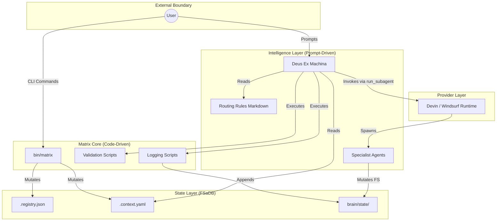
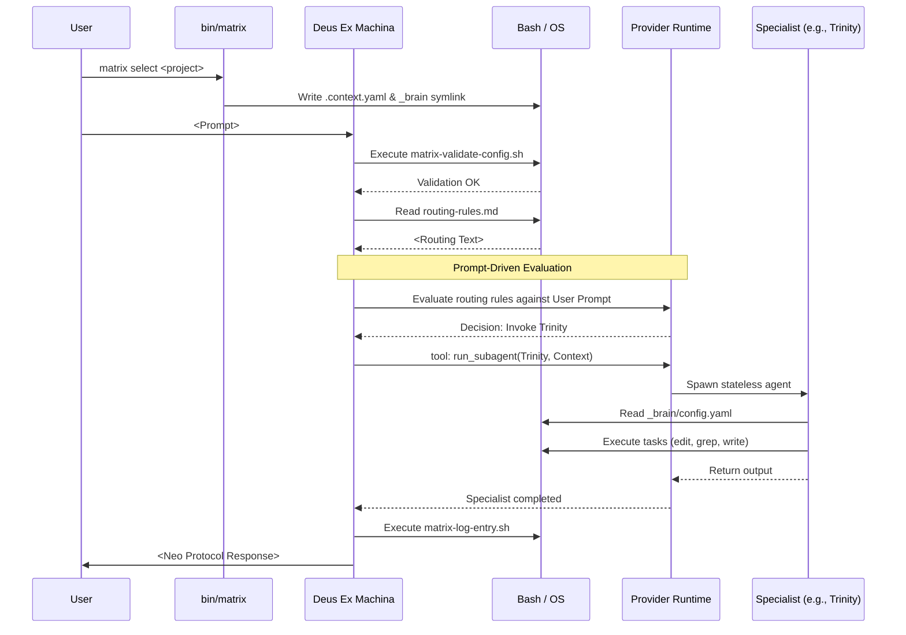
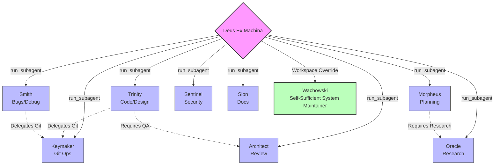

# Runtime Interaction Graphs

This document contains visual representations of the synthesized Matrix architecture.

## 1. High-Level Architecture Diagram

## 2. Runtime Execution Interaction

## 3. Agent Interaction Graph

